<meta name="google-site-verification" content="PzCF2tWFYCvDoGCzjVteERMDIyapvBCNfd355CW9nXI" />

<h1 align="center">John Faulkner | Healthcare & Agentic AI Architect</h1>

  

  

  
  
  
  

  

---

> **Before Agentic AI had a name, I was building the same systems: autonomous, goal-oriented, stateful, and multi-step. I architected them in Epic. Now I'm codifying them in Python.**

---

## 🟩 On the Contribution Gap

**14 years of enterprise healthcare architecture doesn't live on GitHub.**

It lives in production.

Every system I built during that time ran inside locked-down enterprise environments: air-gapped Epic instances, strict BAA agreements, health system IP policies, and clinical infrastructure where a bad commit affects patient care at scale. You don't push that to a personal GitHub. You don't push it anywhere public. That's not a gap in output. That's what serious enterprise healthcare work looks like.

What that period produced:
- **12 Tier 1 health system deployments** across 50,000-user production environments
- **40+** Epic (EHR) Upgrades and Implementations
- **17,000 births/year** coordinated through automated clinical workflows I designed
- **PPH risk scoring, In-Basket routing, pregnancy registry validation, transition record assembly** built inside Epic before the industry had a name for agentic AI
- **14 years of pattern recognition** across broken healthcare workflows that no amount of side-project commits can replicate

What you're seeing now is the codification of that decade-plus of production experience into open-source Python: healthcare agentic AI systems built the way they should have been built from the start.

**The gap isn't where the work stopped. It's where the work lived.**

---

## 🔄 Healthcare to Agentic AI: The Translation

| What I Built in Epic | Agentic AI Equivalent | Pattern |
|---|---|---|
| PPH Risk Scoring (30 rules, automated escalation) | Autonomous decision agent with real-time sensor orchestration | ReAct + Tool Use |
| Epic In-Basket Routing (triage + dispatch) | LLM-powered task routing agent with priority scoring | Plan-and-Execute |
| Pregnancy Registry Validation (rule triggers, exception handling) | Rule/ML hybrid agent loop with exception escalation | Reflection Loop |
| Transition Record Assembly (4 sources to document) | RAG pipeline document generation agent | RAG + Generation |
| 17,000 births/year coordination | Multi-agent orchestration across concurrent stateful workflows | Multi-Agent Orchestration |

## 🏗️ Architectural Philosophy
I design across all four layers of the agentic enterprise: semantic knowledge, model intelligence, agent runtime, and orchestration, with governance embedded from day one. Every production system I ship includes an evaluation harness before it touches a user.

## 👤 About
I'm the CEO and Co-Founder of [The Faulkner Group](https://thefaulknergroupadvisors.com), a boutique advisory firm helping women's health tech founders navigate broken healthcare systems and build AI-native products. My Python and agent work here is the technical foundation behind that advisory practice.

---

## 🧠 Tech Stack

**Orchestration & Agents**

  
  
  
  
  
  

**LLMs Deployed**

  
  
  

**Vector & RAG**

  
  
  
  

**Full Stack**

  
  
  
  
  
  

---

## 🤖 Founder Intelligence Platform · Women's Health Tech

> A 9-agent intelligence ecosystem purpose-built for women's health tech founders, covering every dimension of building, funding, and scaling a healthtech company. Available exclusively to advisory clients of [The Faulkner Group](https://thefaulknergroupadvisors.com).

> **🏛️ Core Infrastructure:** [faulkner-agent-core](https://github.com/jsfaulkner86/faulkner-agent-core) — unified founder profiles, Supabase schema, Notion workspace, secrets management, and master orchestrator powering all 9 agents.

| Agent | What It Does | Status |
|---|---|---|
| [customer-discovery-agent](https://github.com/jsfaulkner86/customer-discovery-agent) | Monitors patient forums, Reddit, app store reviews & social signals to surface real-world unmet needs and sentiment shifts | Public |
| [pitch-narrative-agent](https://github.com/jsfaulkner86/pitch-narrative-agent) | Analyzes successful women's health pitch decks, monitors investor language resonance, and helps founders continuously refine their fundraising narrative | Public |
| [talent-advisor-agent](https://github.com/jsfaulkner86/talent-advisor-agent) | Surfaces relevant advisors, clinical champions, board prospects, and key hires for women's health tech founders | Public |
| [clinical-evidence-agent](https://github.com/jsfaulkner86/clinical-evidence-agent) | Monitors PubMed, ClinicalTrials.gov, and major conferences for new research supporting or threatening founders' clinical claims | Public |
| [partnership-agent](https://github.com/jsfaulkner86/partnership-agent) | Researches health system procurement contacts, payer partnership opportunities, employer benefit brokers, and strategic acquirers | Public |
| [competitive-intel-agent](https://github.com/jsfaulkner86/competitive-intel-agent) | Continuously tracks competitor product launches, fundraises, partnerships, and executive moves in women's health tech | Public |
| [regulatory-agent](https://github.com/jsfaulkner86/regulatory-agent) | Monitors FDA clearance paths, CPT code changes, payer policy updates, and reimbursement trends | Public |
| [grant-agent](https://github.com/jsfaulkner86/grant-agent) | Continuously researches SBIR/STTR, ARPA-H, NIH, and non-dilutive funding opportunities for women's health tech founders | Public |
| [investor-agent](https://github.com/jsfaulkner86/investor-agent) | Continuously researches PE firms, angel investors, VCs, and institutional funders active in women's health with automated discovery and structured reporting | Public |

---

## 🔨 Active Projects

### Python · Agentic AI Systems
| Project | Stack | What It Does | Status |
|---|---|---|---|
| [ehr-mcp](https://github.com/jsfaulkner86/ehr-mcp) | Framework-Agnostic | Interoperability protocol for multi-agent healthcare AI | v0.1.0 Pre-Release |
| [prior-auth-research-agent](https://github.com/jsfaulkner86/prior-auth-research-agent) | CrewAI + RAG | Automates the most broken workflow in healthcare | v0.1.0 Pre-Release |
| [clinical-rag-agent](https://github.com/jsfaulkner86/clinical-rag-agent) | LangChain + Chroma | Delivers clinical guidelines at point of care | 🚧 In Progress |
| [pph-risk-scoring-agent](https://github.com/jsfaulkner86/pph-risk-scoring-agent) | LangGraph | Postpartum hemorrhage risk, real production workflow rebuilt as agent | 🚧 In Progress |
| [clinical-triage-agent](https://github.com/jsfaulkner86/clinical-triage-agent) | LangGraph + Pydantic AI | In-basket logic rebuilt as an agentic triage system | v0.1.0 Pre-Release |
| [healthcare-compliance-guardrail](https://github.com/jsfaulkner86/healthcare-compliance-guardrail) | LangChain + middleware | The compliance layer every healthcare AI needs | v0.1.0 Pre-Release |
| [world-multi-agent-system-for-healthcare](https://github.com/jsfaulkner86/world-multi-agent-system-for-healthcare) | Python | A worldwide multi-agent AI system for healthcare | 🚧 In Progress |
| [perinatal-companion-agent](https://github.com/jsfaulkner86/perinatal-companion-agent) | Python | From the start of your pregnancy journey until 1 year after birth | 🚧 In Progress |

### TypeScript · Women's Health Tech Products
| Project | What It Does |
|---|---|
| [femtechdb](https://github.com/jsfaulkner86/femtechdb) | World database of femtech companies, updated via daily cron job |
| [womenshealthfundraisingtracker](https://github.com/jsfaulkner86/womenshealthfundraisingtracker) | Pipeline tracker built for women's health founders |
| [tfgdmpersonalizer](https://github.com/jsfaulkner86/tfgdmpersonalizer) | Claude + Google Xray, personalizes LinkedIn outreach at scale |
| [tfg-website](https://github.com/jsfaulkner86/tfg-website) | The Faulkner Group advisory website, React + Tailwind + Vite |

### Advisory Agents
| Project | What It Does |
|---|---|
| [fundraising-agent](https://github.com/jsfaulkner86/fundraising-agent) | Sharpens investor narratives for women's health founders |
| [product-roadmap-agent](https://github.com/jsfaulkner86/product-roadmap-agent) | Product & strategy partner for early-stage founders |
| [market-competitor-agent](https://github.com/jsfaulkner86/market-competitor-agent) | Market research agent scoped to women's health tech |

<h3 align="center">🤖 Multi-Agent Systems in Action</h3>

  

---

## 📊 GitHub Activity

  
  
  
  
  
  
  

  

  
  

  

---

## 🏥 Healthcare Background

- **Epic EHR Architect**, 12 enterprise health systems, 50,000-user production deployments
- **CEO and Co-Founder, The Faulkner Group**, Boutique healthcare AI advisory for women's health tech leaders
- **Senior AI Advisor, Panova Health and Strategic Advisor, Navo Health**
- Domains: Prior Auth, Clinical Triage, In-Basket Workflows, HIPAA-Compliant AI, Maternal Health

---

## 📜 Certifications

| Certification | Issuer | Status |
|---|---|---|
| Agentic AI & AI Evaluation in Healthcare | Harvard Data Science Initiative | ✅ Completed 2026 |
| RAG & Agentic AI Professional | IBM | ✅ Completed 2026 |

## 🏛️ Professional Affiliations
- **PATCA**, Board Member
- **HIMSS**, Member
- **PMI**, Member

---

## 📬 Connect

| | |
|---|---|
| 🌐 Website | [thefaulknergroupadvisors.com](https://thefaulknergroupadvisors.com) |
| 💼 LinkedIn | [linkedin.com/in/johnathonfaulkner](https://linkedin.com/in/johnathonfaulkner) |
| 🏢 Company | The Faulkner Group, Bloomfield Hills, Michigan |
| 🏛️ Company LinkedIn | [linkedin.com/company/faulkner-group](https://www.linkedin.com/company/faulkner-group/?viewAsMember=true) |
