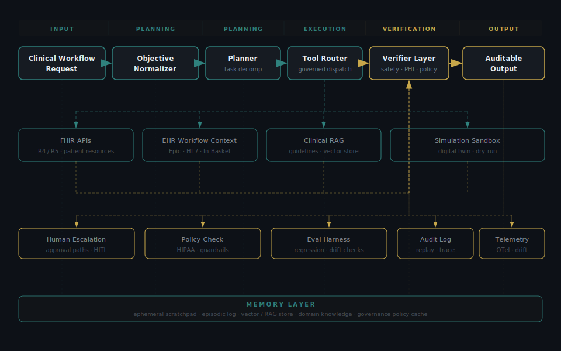

<h1 align="center">John Faulkner</h1>

  <strong>Agentic Healthcare AI Architect</strong> 
  Translating enterprise clinical workflow patterns into inspectable, governed, production-grade agentic AI systems.

  <a href="https://thefaulknergroupadvisors.com">The Faulkner Group</a> ·
  <a href="https://linkedin.com/in/johnathonfaulkner">LinkedIn</a> ·
  Healthcare Workflow Systems ·
  Epic EHR to Agentic AI

---

## Architecture thesis

I design agentic AI systems for healthcare workflows where trust, traceability, escalation, and operational fit matter.

My work translates production Epic-era automation patterns into modern agent architectures: objective normalizers, planners, tool routers, FHIR/EHR interfaces, RAG pipelines, clinical safety verifiers, human approval paths, audit logs, and evaluation harnesses.

These are not demo agents. They are healthcare workflow systems designed around PHI boundaries, clinical risk, governance, observability, and operational handoff.

---

## Agentic healthcare system spine

  

---

## Production background

- **14 years** designing enterprise healthcare workflow systems in Epic environments
- **12 Tier 1 health system deployments**
- **50,000-user production environments**
- **40+ Epic upgrades and implementations**
- **17,000 births/year** coordinated through automated clinical workflow design
- Clinical domains: maternal health, prior authorization, In-Basket routing, registry validation, transition-of-care documentation

---

## Open-source architecture portfolio

| Layer | Repository | What it demonstrates |
|---|---|---|
| Interoperability | [`ehr-mcp`](https://github.com/jsfaulkner86/ehr-mcp) | Framework-agnostic FHIR R4 data layer — SMART-on-FHIR auth, ClinicalContextBundle, multi-agent protocol design |
| Operations visibility | [`agentic-healthcare-ops`](https://github.com/jsfaulkner86/agentic-healthcare-ops) | Real-time AOC dashboard — 9 agents on a hospital floor map, LangGraph prior auth wired to Epic FHIR R4 |
| Clinical workflow agents | [`clinical-triage-agent`](https://github.com/jsfaulkner86/clinical-triage-agent) | Epic In-Basket routing translated into LangGraph and PydanticAI |
| Women's health workflow systems | [`pph-risk-scoring-agent`](https://github.com/jsfaulkner86/pph-risk-scoring-agent) | Stateful escalation logic for postpartum hemorrhage risk |
| Governance and safety | [`healthcare-compliance-guardrail`](https://github.com/jsfaulkner86/healthcare-compliance-guardrail) | PHI-aware guardrails, policy checks, approval boundaries, and compliance middleware |
| Kill switch protocols | [`ai-killswitch-protocol`](https://github.com/jsfaulkner86/ai-killswitch-protocol) | Kill Switch Protocol for AI Agents and Healthcare Digital Twins |
| Clinical knowledge retrieval | [`clinical-rag-agent`](https://github.com/jsfaulkner86/clinical-rag-agent) | Clinical guideline retrieval architecture for point-of-care support |

---

## Architecture patterns I build around

| Pattern | Healthcare use case and design concern |
|---|---|
| Objective normalization | Turning ambiguous clinical requests into structured goals and policies — prevents agents acting on vague or unsafe instructions |
| Planner plus task graph | Decomposing multi-step healthcare workflows into observable, interruptible steps — supports review, replay, and operational handoff |
| Tool routing | Calling EHR, FHIR, RAG, scheduling, and analytics systems through governed interfaces — keeps autonomy bounded by explicit tool contracts |
| Verifier layer | Checking clinical safety, PHI handling, and policy fit before action — reduces unsafe automation and hallucinated workflow execution |
| Human escalation | Routing uncertain or high-risk decisions to accountable humans — keeps clinical accountability intact |
| Evaluation harness | Testing agents against known workflow cases, edge conditions, and failure modes — makes quality measurable before deployment |
| Audit and replay | Capturing plans, tool calls, intermediate state, and outputs — enables governance, incident review, and continuous improvement |

---

## Design principles

- **Start with workflow, not model choice.** The agent architecture should reflect the operational pathway, exception handling, and human escalation model.
- **Make every agent inspectable.** Plans, tool calls, intermediate state, policy decisions, and outputs should be traceable and replayable.
- **Govern before autonomy.** Healthcare agents need approval thresholds, PHI boundaries, kill switches, audit trails, and role-based escalation.
- **Evaluate against clinical risk.** Accuracy alone is not enough. Evaluation should include safety, latency, drift, equity, and failure-mode analysis.
- **Use agents only where agents are warranted.** If a deterministic workflow, rules engine, or single LLM call with tools is enough, do not create a multi-agent system.

---

## Currently shipping

- **`agentic-healthcare-ops`** — live Epic FHIR R4 prior auth pipeline with Availity X12-278 write-back and real-time AOC floor map
- **`ehr-mcp`** — FHIR R4 MCP server with SMART-on-FHIR auth and ClinicalContextBundle for multi-agent EHR access
- **`ai-killswitch-protocol`** — kill switch and human-in-the-loop governance protocol for clinical AI agents and digital twins
- Next: evaluation harness and LangSmith tracing integration across the full portfolio

---

## Technical stack

| Area | Tools and patterns |
|---|---|
| Agent orchestration | LangGraph, LangChain, CrewAI, PydanticAI, AutoGen |
| Healthcare interoperability | Epic workflow patterns, FHIR R4, HL7, EHR integration design |
| Retrieval and knowledge systems | RAG, vector stores, Chroma, Pinecone, pgvector |
| Backend systems | Python, FastAPI, TypeScript, Node.js |
| Frontend / visualization | Next.js 14, PixiJS 8, Zustand, Tailwind CSS |
| Evaluation and observability | pytest, LangSmith-style tracing, policy checks, audit logs, replayable workflows |
| Governance | PHI boundaries, role-based approvals, escalation paths, clinical safety review, compliance guardrails |

---

## Healthcare workflow translation

| Production healthcare pattern | Agentic AI system equivalent |
|---|---|
| Epic agent operations visibility | Real-time AOC with avatar-per-agent, live speech bubbles, HITL queue, and WebSocket event feed |
| Epic In-Basket routing | Clinical task triage agent with prioritization, routing, and escalation |
| PPH risk scoring | Stateful risk agent with rule evaluation, thresholding, and human review |
| Prior authorization research | End-to-end LangGraph workflow — FHIR read, GPT-4o criteria eval, Availity X12-278, Epic write-back |
| Pregnancy registry validation | Rule and exception-handling loop with structured verification |
| Transition-of-care documentation | Multi-source RAG pipeline with auditable document assembly |

---

## Background

I am the CEO and Co-Founder of [The Faulkner Group](https://thefaulknergroupadvisors.com), a healthcare AI advisory firm focused on women's health technology, clinical workflow architecture, and AI-native operating models.

Before building open-source healthcare agents, I spent more than a decade designing and supporting enterprise Epic workflows in production environments where reliability, governance, and operational adoption were not optional.

This GitHub profile is where I codify those healthcare workflow patterns into agentic AI reference architectures, prototypes, and implementation playbooks.

---

## Connect

If you're building clinical AI and need an architect who has shipped it in production Epic environments — [reach out](mailto:john@tfgpartner.com).

| Channel | Link |
|---|---|
| Website | [thefaulknergroupadvisors.com](https://thefaulknergroupadvisors.com) |
| LinkedIn | [linkedin.com/in/johnathonfaulkner](https://linkedin.com/in/johnathonfaulkner) |
| GitHub | [github.com/jsfaulkner86](https://github.com/jsfaulkner86) |
